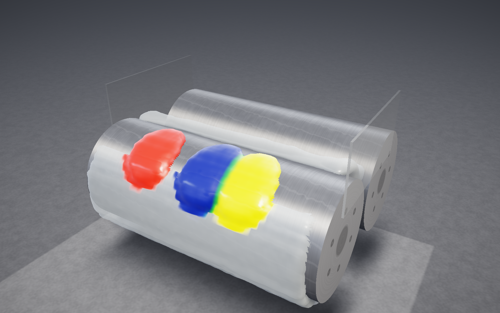
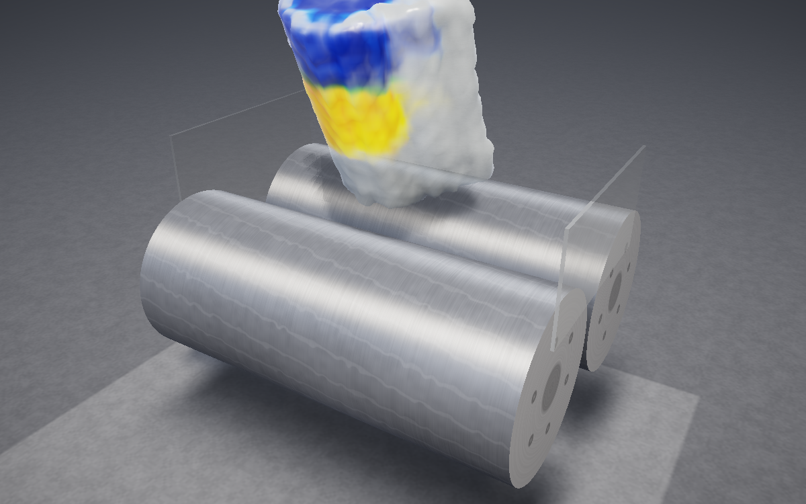
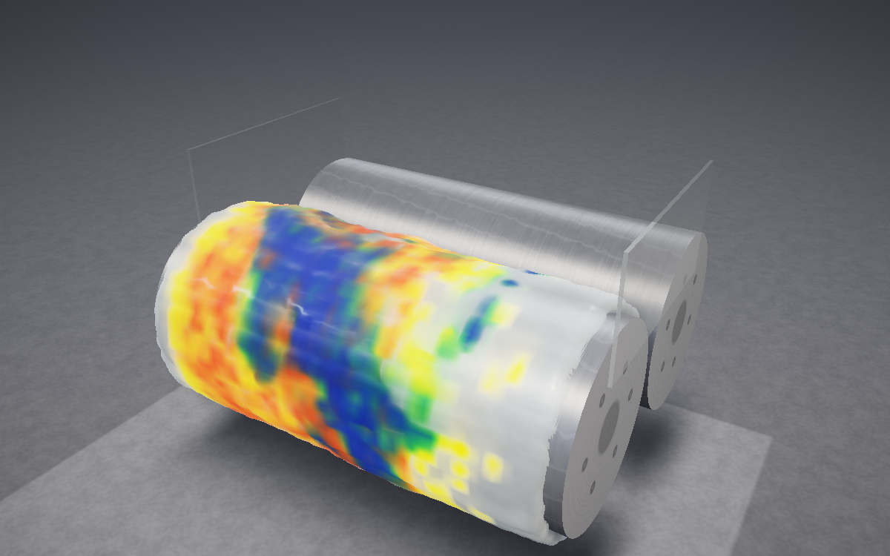
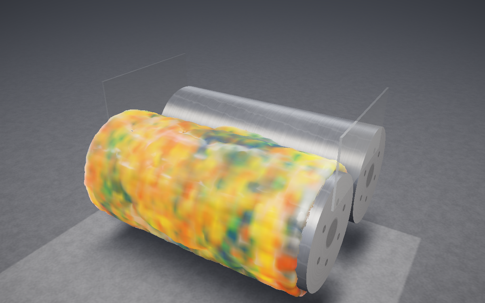

# ColorMill

A **two-roll mill simulator** in the browser. A bank of clear silicone putty
sits on two counter-rotating rolls, is dragged through the nip, sheets onto
the front roll, and is cut off, rolled into a log and fed back in end-first.
Drop pigment on the bank and watch it streak, fold and disperse through the
batch, mixed the way real pigments mix: blue and yellow make green, not grey.



Everything runs on the GPU through **WebGPU compute**: the putty is hundreds
of thousands of material points (MLS-MPM), the pigment lives in Mixbox latent
space, and the picture is a ray-marched glossy surface. A v1 CPU proof of
concept (C / raylib / Emscripten) is kept as a legacy build for browsers
without WebGPU.

**Live:** <https://andrewboudreau.github.io/ColorMill/> ·
**How it works:** <https://andrewboudreau.github.io/ColorMill/overview.html> ·
**Colour mixer:** <https://andrewboudreau.github.io/ColorMill/mixer.html> ·
**Project notes:** <https://andrewboudreau.github.io/ColorMill/project.html> ·
**Design spec:** [`docs/design-v2.md`](docs/design-v2.md) ·
**Research log:** [`docs/research.md`](docs/research.md)

## What you see

- **The bank.** Putty resting in the valley between the rolls, slumping toward
  the gap under gravity and the pull of the roll surfaces.
- **The nip.** The rolls squeeze the putty through a narrow gap. The back roll
  turns faster than the front (the *friction ratio*), so the gap is a shear
  zone, and it is the only place colours really mix.
- **The sheet.** The front roll is tackier, so the putty leaves the nip stuck
  to it as a thin sheet and comes back over the top to rejoin the bank.
- **Cut & fold, cut & roll.** A mill has no sideways transport of its own;
  the operator supplies it. Cut & fold cuts the sheet on the front roll from
  the end toward the middle while it comes up, which frees a triangular flap,
  then folds the flap over the cut onto the sheet beside it, toward the
  middle, alternating ends. Cut & roll takes everything off, rolls it
  into a log and feeds it back in end-first. ColorMill scripts both moves; a
  few rounds turn stripes into a blend.
- **Pigment.** The base is clear silicone. A tap sets a chunk of concentrated
  masterbatch down on the bank at one of six drop spots along the roll, in one
  of three sizes, and chunks stack if you tap the same spot again.

<table>
  <tr>
    <td></td>
    <td></td>
    <td></td>
  </tr>
  <tr>
    <td align="center"><sub>Cut &amp; roll: the log stands over the nip</sub></td>
    <td align="center"><sub>After one pass</sub></td>
    <td align="center"><sub>After two passes</sub></td>
  </tr>
</table>

## How it works

The material is simulated with the **Material Point Method** (MLS-MPM, Hu et
al. 2018) with quadratic B-spline transfers and APIC affine velocities.
Particles carry position, velocity, an affine velocity matrix, an elastic
deformation gradient, a 7-float Mixbox pigment latent and a pigment load. A
background grid (49×73×65 to 109×163×145 nodes, depending on the preset,
taller than it is wide to leave room for the log and deeper than the mill to
leave room in front for the operator's hands) is scratch space rebuilt every
substep:
particles scatter mass and momentum to grid nodes with fixed-point atomics,
the grid integrates gravity and applies the boundaries, and the particles
gather the new velocities back and advect. A fixed number of substeps runs
per rendered frame, so a run is deterministic whatever the frame rate.

The material model is an **elastoplastic putty**: fixed-corotated elasticity
with a deviatoric-only plastic return. Each step the shape part of the
deformation gradient is clamped to a small yield band while the volume part is
kept, so the pressure term keeps resisting compression and the nip cannot pack
material beyond rest density. A short viscoplastic relaxation lets yielded
material keep flowing under sustained shear instead of locking into a shear
band. The bank slumps into a rolling bank, yields and flows under the nip's
shear, and does not spring back.

The mill itself is a set of grid boundary conditions. The **front roll** is
sticky within a thin band of its surface, so the sheet is carried around with
it. The **back roll** is a separating Coulomb-friction contact that turns
faster by the friction ratio (1.0–1.6), so the nip shears as well as squeezes.
The domain's end walls are the guide cheeks and the floor is the tray.

Pigment is a **Mixbox latent** per particle (three Kubelka–Munk pigment
weights and a residual), so transport and blending are plain weighted
averages and blue and yellow fold into green. Mixing is driven by the local
shear rate: once per frame each particle relaxes toward the latent of its
neighbourhood in proportion to how hard it is being sheared, so colours stay
crisp in the resting bank and blend in the nip. The clear base carries no
pigment at all; a chunk's load spreads out as it is milled and the colour
gets deeper where the load is higher.

**Cut & fold** cuts the sheet on the front face of the front roll from the
roll end toward the middle while the sheet comes up past the knife, so the
cut is a diagonal and the freed flap is a triangle, pointed at the top near
the roll end and wide at the bottom. The flap turns up on the cut like a page,
out in front of the roll and over onto the sheet beside the cut, roll-side
up, and the doubled sheet rides up into the nip. **Cut & roll** takes
everything on the mill, winds it into a
volume-preserving log standing over the nip (bank kneaded into the core,
sheet wrapped around it), and sets the log down on the nip for the rolls to
pull in (the **Log feed** slider lowers it in end-first instead, released only
onto the pile the rolls are eating). Material from every position along the roll ends up in the log's
cross-section and is spread back across the width as the nip flattens it.
Nothing is lost or invented.

The rendering is a single fullscreen ray-march through 3D textures of density
and pigment: it finds the putty's surface, shades it as glossy silicone with
a colour that deepens with pigment load, and composites the brushed-metal
rolls and the tray analytically so they stay crisp at any grid resolution.

Full detail, including every constant and the alternatives that were tried
and rejected, is in [`docs/design-v2.md`](docs/design-v2.md) and
[`docs/research.md`](docs/research.md).

## Colour mixer

`mixer.html` is a standalone page for trying pigment recipes before dropping
them on the bank: pick pigments in parts and see the Mixbox result, a blend
ladder and some starter recipes. It uses the same pigment latents and the
same mass-weighted latent mixing as the simulation, so its swatch is the
colour the mill will converge to once the bank is homogeneous; the naive RGB
average is shown beside it for contrast. A recipe can be shared and restored
with a link such as `?mix=cadmiumYellow:3,cobaltBlue:1`. **Open in the mill**
hands the recipe to the simulator as a `?drops=` link (one medium chunk per
part, halves as small chunks, spread along the roll).

The palette leads with the pigments silicone colour houses actually use
(iron oxides, titanium dioxide, carbon black, phthalocyanines, ultramarine,
azo and quinacridone organics, plus a turquoise and a flesh paste), then,
after a divider, the rest of the Mixbox oil-paint set (cadmiums, cobalts,
the mixed greens) for range; see design §5 for what each colour is and
where its value came from. Old names such as `cobaltTeal` and `ivoryBlack`
still resolve, so existing links keep working.

The mixing rule was checked against footage of a real mill: red, yellow and
teal bands of equal width milled to `#a4634b`, and Mixbox mixes the three
sampled band colours in equal parts to `#a27242` (the plain RGB average is an
olive). The **Terracotta** starter is the nearest palette recipe, and
`index.html?drops=naphtholRed@1.l,naphtholRed@2.l,hansaYellow@3.l,hansaYellow@4.l,cobaltTeal@5.l,cobaltTeal@6.l`
lays the same three bands on the bank.

## Controls

| Input | Action |
| --- | --- |
| Drop-slot strip (bottom bar) | Pick which of the 6 spots along the roll the next tap lands on (also `[` / `]`, or `?slot=3`) |
| Chunk-size dots (bottom bar) | Small, medium or large chunk for the next tap (also `-` / `=`, or `?chunk=s`, `m`, `l`) |
| Tap a swatch (bottom bar) | Set a chunk of that pigment down on the bank at the chosen spot (chunks stack) |
| Colour picker swatch | Inject a custom colour (converted to a Mixbox latent at runtime) |
| **Cut & fold** / `C` | Cut the sheet on the front roll from the end and fold the triangular flap over the cut toward the middle (ends alternate) |
| **Cut & roll** / `F` | Cut everything off, roll it into a log and drop it back on the nip (or lower it in: **Log feed** slider) |
| **Clear pigment** | Reset every particle to clear silicone |
| **Reset** / `R` | Re-seed the bank |
| **Pause** / `Space` | Pause / resume |
| `1`–`8` | Inject palette pigments 1–8 (the silicone pastes: naphthol red, hansa yellow, phthalo blue, phthalo green, phthalo turquoise, iron oxide red, carbon black, titanium white) |
| `↑` / `↓`, `←` / `→` | Roller speed, nip gap |
| `[` / `]` | Move the pigment drop slot left / right |
| `-` / `=` | Smaller / larger pigment chunks |
| Drag / wheel / pinch | Orbit / zoom the camera; double-tap resets to the front view |
| Right drawer (`P`) | Roller speed (rpm), friction ratio, nip gap, dispersion, gravity, back-roll friction, batch size, quality, auto-orbit, stats |
| `?drops=cadmiumYellow@3.m,cobaltBlue@5.l` | Start with those pigment chunks already dropped (pigment@slot.size; size s, m or l; a custom colour as six hex digits); the drawer's **Copy start link** writes the current session's drops as such a link |

## Quality presets

| Preset | Cells / unit | Grid (cells) | Particles at 1× batch | Substep `dt` | Substeps / frame | Target |
| --- | --- | --- | --- | --- | --- | --- |
| low | 32 | 49 × 73 × 65 | 39k | 1.6e-3 | 8 | integrated / mobile GPU |
| medium | 48 | 73 × 109 × 97 | 133k | 1.1e-3 | 12 | laptop GPU |
| high (default) | 64 | 97 × 145 × 129 | 315k | 8e-4 | 16 | desktop GPU |
| ultra | 72 | 109 × 163 × 145 | 448k | 7.1e-4 | 18 | discrete GPU |

The default batch is about 1.2 L of putty; the batch-size control (0.5×–3×,
or `?batch=1.5`) rebuilds the bank with more or less material and scales the
particle count with it. The HUD reports the material on the mill in litres and
kg, so conservation is visible.

The app picks `medium` on non-discrete adapters (`low` on mobile user agents)
and `high` otherwise; override with the quality select or `?preset=low` in the
URL. It also steps the preset down when frames stay above 45 ms, unless a
preset was chosen explicitly. Simulated time per rendered frame is
`dt × substeps` (about 13 ms), so at 60 fps the mill runs at about 0.8× real
time; the HUD shows the ratio.

## Run, test, build

```bash
npm install
npm run dev          # Vite dev server at http://localhost:5173/ColorMill/
npm test             # vitest unit tests (pure TypeScript: config, geometry, colour)
npm run build        # tsc --noEmit && vite build -> dist/
npm run preview      # serve dist/
npm run test:e2e     # Playwright e2e in headless Chromium + SwiftShader WebGPU
```

The end-to-end tests (`tests/e2e/*.spec.mjs`) drive the real app through the
debug hooks it exposes on `window.__colormill` (`DebugApi` in
[`src/sim/types.ts`](src/sim/types.ts)): they run the `low` preset for a few
dozen frames, read the particle state back and check for NaNs, escapes from
the domain and particles inside the rollers, inject two pigments, and save a
screenshot to `tests/e2e/out/app.png`. They need a Chromium — run
`npx playwright install --with-deps chromium` once, or point
`COLORMILL_CHROMIUM` at one. `E2E_MODE=preview npm run test:e2e` tests the
production bundle instead of the dev server (this is what CI does).
`npm run test:e2e app` runs only the specs whose file name contains `app`,
and `E2E_SOLVER_FOLD=1` makes the solver spec exercise cut & roll too.

The screenshots in this README were rendered the same way, headless through
the debug API at the `low` preset.

Native C:

```bash
make ref             # v2 CPU reference solver (src/sim/millref.c) -> build/millref
make native          # v1 raylib desktop app (needs libraylib)
make web             # v1 Emscripten build -> dist/ (needs emsdk + raylib built for web)
```

### Build layout

`npm run build` writes the Vite app to `dist/` and copies the static docs
pages from `web/` next to it, so the nav links keep working from the site
root:

```
dist/
  index.html, assets/        the v2 WebGPU app
  mixer.html                 the colour mixer (second Vite entry; src/mixer/)
  overview.html              how it works (the short, high-level page)
  project.html               project notes (the guided tour)
  resources.html             references and vocabulary
  pigment.html               Mixbox WebGL demo
  vendor/mixbox/             mixbox.js + mixbox.glsl (see license below)
  legacy/                    (Pages only) the v1 C/raylib/wasm build
```

`web/` is the source of truth for the docs pages (`web/shell.html` is the
Emscripten shell for the legacy build and is not copied). The Vite dev server
serves the same files, so `/ColorMill/overview.html` works under `npm run dev`
too.

## Deployment and CI

- **CI** (`.github/workflows/ci.yml`, PRs and pushes to `main`): a `web` job
  (type-check, unit tests, build, Playwright e2e), a `native` job (the v1 CPU
  solver still compiles; `make ref` builds the reference solver) and a
  `legacy-web` job (the Emscripten build).
- **Pages** (`.github/workflows/pages.yml`, pushes to `main`): builds the v2
  app into `dist/`, then the legacy v1 app into `dist/legacy/`, and deploys
  `dist/` to GitHub Pages.

## Browser support

ColorMill v2 needs **WebGPU** with compute shaders: Chrome / Edge 113+,
Safari 26+ (macOS, iOS), Firefox 141+ (Windows; other platforms behind
`dom.webgpu.enabled`). Hardware acceleration must be on. Everything is
`f32`; no optional features are required (timestamp queries are used for the
GPU-time readout when available).

Without WebGPU the app shows a message and a link to the **legacy CPU build**
at [`legacy/index.html`](https://andrewboudreau.github.io/ColorMill/legacy/index.html):
the v1 40³-grid MLS-MPM solver in C compiled to WebAssembly, drawn as voxels
with raylib. It runs anywhere with WebGL 2 but at a fraction of the
resolution.

## Layout

```
index.html, src/main.ts        v2 app entry and frame loop
mixer.html, src/mixer/         the colour mixer page (pure mixing logic in mixer.ts, tested)
src/config/mill.ts             geometry, presets, material constants (pure, tested)
src/sim/                       GpuMpmSim + WGSL compute shaders; types.ts is the shared contract
src/render/                    ray-march renderer, camera, mixbox.wgsl
src/color/                     pigment palette latents, latentToRgb
src/ui/, src/styles.css        panel, HUD, palette
src/sim/millref.c, tools/      C reference of the v2 physics (make ref)
src/main.c, src/sim/*.c        v1 CPU app (legacy build)
tests/*.test.ts                vitest
tests/e2e/                     Playwright specs (lib.mjs, run.mjs, *.spec.mjs)
web/                           docs pages + Emscripten shell + vendored Mixbox
docs/                          design-v2.md, research.md, screenshots/
```

## License notes

The simulator code is the project's own. Pigment mixing uses **Mixbox**
(Sochorová & Jamriška, *Practical Pigment Mixing*, SIGGRAPH Asia 2021),
vendored under `web/vendor/mixbox/` and ported to WGSL/TypeScript for the
renderer. Mixbox is licensed **CC BY-NC 4.0 — non-commercial use only, with
attribution**. ColorMill is a research/education project and complies with
those terms; a commercial use would need a license from the Mixbox authors
(<https://github.com/scrtwpns/mixbox>). raylib (legacy build) is zlib
licensed.
