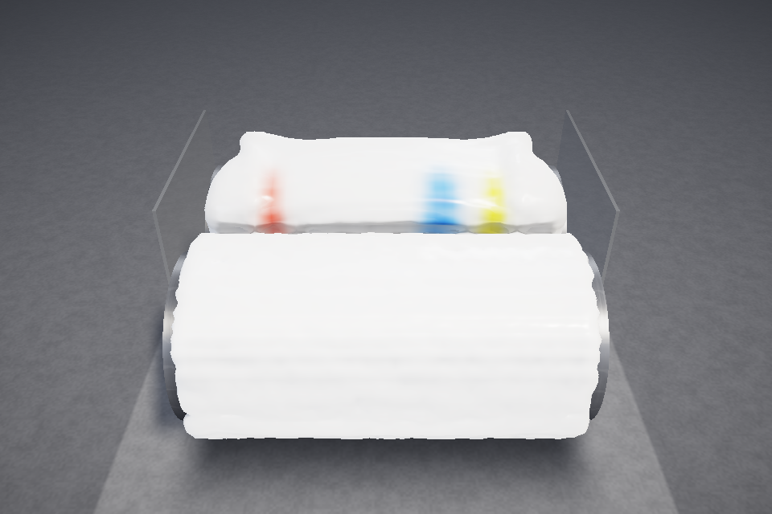

# ColorMill

A browser-based **two-roll mill simulator**: a bank of white silicone putty


sits on two counter-rotating rollers, gets dragged through the nip, sheets
onto the front roll, and is cut off, rolled into a log, stood over the nip and fed back
in end-first. Tap a pigment to drop a chunk of concentrated coloured putty on the bank and
watch it streak and fold through the batch — blue and yellow fold into real green, not grey.

Version 2 runs the whole thing on the GPU with **WebGPU compute** (MLS-MPM
with hundreds of thousands of material points) and renders it with a
ray-marched glossy surface and Mixbox pigment mixing. The v1 CPU proof of
concept (C / raylib / Emscripten) is kept as a legacy build for browsers
without WebGPU.

Live: <https://andrewboudreau.github.io/ColorMill/> ·
How it works: <https://andrewboudreau.github.io/ColorMill/overview.html> ·
Design spec: [`docs/design-v2.md`](docs/design-v2.md) ·
Project notes: [`web/project.html`](web/project.html) ·
Research log: [`docs/research.md`](docs/research.md)

## The physics, briefly

The material is simulated with the **Material Point Method** (MLS-MPM,
Hu et al. 2018) with quadratic B-spline transfers and APIC affine velocities.
Particles carry position, velocity, an affine velocity matrix, an elastic
deformation gradient and a 7-float Mixbox pigment latent; a background grid
(48³ to 120³ cells depending on the preset) is scratch space rebuilt every
substep: particles scatter mass and momentum to grid nodes (fixed-point
atomics), the grid integrates gravity and applies the boundaries, and the
particles gather the new velocities back and advect. The material model is an
**elastoplastic putty**: fixed-corotated elasticity with a deviatoric-only
plastic return (the shape part of the deformation gradient is clamped to a
small yield band each step; the volume part is kept, so the pressure term
keeps resisting compression and the nip cannot pack material beyond rest
density). The bank slumps into a rolling bank, yields and flows under the
nip's shear, and does not spring back.

The mill itself is a set of grid boundary conditions. The **front roller** is
sticky: nodes within a tack band of its surface take the roller's velocity, so
the sheet is carried around with it. The **back roller** is a separating
Coulomb-friction contact. The back roller runs faster than the front one
(the **friction ratio**, 1.0–1.6), so material in the nip is sheared, not just
squeezed; the domain's end walls act as guide cheeks and the floor is the
tray. Pigment is tracked as a **Mixbox latent** per particle and mixed only
where the material is actually sheared: once per frame each particle relaxes
its latent toward the local node average at a rate proportional to its shear
rate, so mixing happens at the nip and not in the resting bank. A scripted
**cut & roll** takes everything off the mill, winds it into a log (bank at
the core, sheet around it) and feeds the log back in end-first over the nip,
which is the only axial transport a real mill gets. Full detail, including every constant, is in
[`docs/design-v2.md`](docs/design-v2.md).

## Controls

| Input | Action |
| --- | --- |
| Drop-slot strip (bottom bar) | Pick which of the 6 spots along the roll the next tap lands on (also `[` / `]`, or `?slot=3`) |
| Tap a swatch (bottom bar) | Set a chunk of that pigment down on the bank at the chosen spot (chunks stack) |
| Colour picker swatch | Inject a custom colour (converted to a Mixbox latent at runtime) |
| **Cut & roll** / `F` | Run the operator's cut-roll-and-feed move |
| **Clear pigment** | Reset every particle to white silicone |
| **Reset** / `R` | Re-seed the bank |
| **Pause** / `Space` | Pause / resume |
| `1`–`8` | Inject palette pigments 1–8 |
| `↑` / `↓`, `←` / `→` | Roller speed, nip gap |
| `[` / `]` | Move the pigment drop slot left / right |
| Drag / wheel / pinch | Orbit / zoom the camera; double-tap resets to the front view |
| Right drawer | Roller speed (rpm), friction ratio, nip gap, dispersion, gravity, quality, auto-orbit, stats |

## Quality presets

| Preset | Cells / unit | Grid (cells) | Particles (approx.) | Substep `dt` | Substeps / frame | Target |
| --- | --- | --- | --- | --- | --- | --- |
| low | 32 | 48 × 72 × 48 | 85k | 1.6e-3 | 8 | integrated / mobile GPU |
| medium | 48 | 72 × 108 × 72 | 285k | 1.1e-3 | 12 | laptop GPU |
| high (default) | 64 | 96 × 144 × 96 | 683k | 8e-4 | 16 | desktop GPU |
| ultra | 72 | 108 × 162 × 108 | 972k | 7.1e-4 | 18 | discrete GPU |

A batch-size control (0.5×–3×, default about 1.2 L) rebuilds the bank with more or less material,
and the HUD reports the material on the mill in litres and kg so conservation
is visible. The base putty renders as clear silicone that pigment makes opaque.

The app steps the preset down automatically when frames stay above 45 ms
(unless a preset was chosen explicitly), so a slow GPU lands on the largest
preset it can run.

The app picks `medium` on non-discrete adapters (`low` on mobile user agents)
and `high` otherwise; override with the quality select or `?preset=low` in the
URL. Simulated time per rendered frame is `dt × substeps` (≈13 ms at `high`),
so at 60 fps the mill runs at about 0.8× real time; the HUD shows the ratio.

## Run, test, build

```bash
npm install
npm run dev          # Vite dev server at http://localhost:5173/ColorMill/
npm test             # vitest unit tests (pure TypeScript: config, geometry, colour)
npm run build        # tsc --noEmit && vite build -> dist/
npm run preview      # serve dist/
npm run test:e2e     # Playwright e2e in headless Chromium + SwiftShader WebGPU
```

The end-to-end tests (`tests/e2e/*.spec.mjs`) drive the real app through the
debug hooks it exposes on `window.__colormill` (`DebugApi` in
[`src/sim/types.ts`](src/sim/types.ts)): they run the `low` preset for a few
dozen frames, read the particle state back and check for NaNs, escapes from
the domain and particles inside the rollers, inject two pigments, and save a
screenshot to `tests/e2e/out/app.png`. They need a Chromium — run
`npx playwright install --with-deps chromium` once, or point
`COLORMILL_CHROMIUM` at one. `E2E_MODE=preview npm run test:e2e` tests the
production bundle instead of the dev server (this is what CI does).
`npm run test:e2e app` runs only the specs whose file name contains `app`.

Native C:

```bash
make ref             # v2 CPU reference solver (src/sim/millref.c) -> build/millref
make native          # v1 raylib desktop app (needs libraylib)
make web             # v1 Emscripten build -> dist/ (needs emsdk + raylib built for web)
```

### Build layout

`npm run build` writes the Vite app to `dist/` and copies the static docs
pages from `web/` next to it, so the nav links keep working from the site
root:

```
dist/
  index.html, assets/        the v2 WebGPU app
  overview.html              how it works (the short, high-level page)
  project.html               project notes
  resources.html             references and vocabulary
  pigment.html               Mixbox WebGL demo
  vendor/mixbox/             mixbox.js + mixbox.glsl (see license below)
  legacy/                    (Pages only) the v1 C/raylib/wasm build
```

`web/` is the source of truth for the docs pages (`web/shell.html` is the
Emscripten shell for the legacy build and is not copied). The Vite dev server
serves the same files, so `/ColorMill/project.html` works under `npm run dev`
too.

## Deployment and CI

- **CI** (`.github/workflows/ci.yml`, PRs and pushes to `main`): a `web` job
  (type-check, unit tests, build, Playwright e2e), a `native` job (the v1 CPU
  solver still compiles; `make ref` builds the reference solver) and a
  `legacy-web` job (the Emscripten build).
- **Pages** (`.github/workflows/pages.yml`, pushes to `main`): builds the v2
  app into `dist/`, then the legacy v1 app into `dist/legacy/`, and deploys
  `dist/` to GitHub Pages.

## Browser support

ColorMill v2 needs **WebGPU** with compute shaders: Chrome / Edge 113+,
Safari 26+ (macOS, iOS), Firefox 141+ (Windows; other platforms behind
`dom.webgpu.enabled`). Hardware acceleration must be on. Everything is
`f32`; no optional features are required (timestamp queries are used for the
GPU-time readout when available).

Without WebGPU the app shows a message and a link to the **legacy CPU build**
at [`legacy/index.html`](https://andrewboudreau.github.io/ColorMill/legacy/index.html):
the v1 40³-grid MLS-MPM solver in C compiled to WebAssembly, drawn as voxels
with raylib. It runs anywhere with WebGL 2 but at a fraction of the
resolution.

## Layout

```
index.html, src/main.ts        v2 app entry and frame loop
src/config/mill.ts             geometry, presets, material constants (pure, tested)
src/sim/                       GpuMpmSim + WGSL compute shaders; types.ts is the shared contract
src/render/                    ray-march renderer, camera, mixbox.wgsl
src/color/                     pigment palette latents, latentToRgb
src/ui/, src/styles.css        panel, HUD, palette
src/sim/millref.c, tools/      C reference of the v2 physics (make ref)
src/main.c, src/sim/*.c        v1 CPU app (legacy build)
tests/*.test.ts                vitest
tests/e2e/                     Playwright specs (lib.mjs, run.mjs, *.spec.mjs)
web/                           docs pages + Emscripten shell + vendored Mixbox
docs/                          design-v2.md, research.md
```

## License notes

The simulator code is the project's own. Pigment mixing uses **Mixbox**
(Sochorová & Jamriška, *Practical Pigment Mixing*, SIGGRAPH Asia 2021),
vendored under `web/vendor/mixbox/` and ported to WGSL/TypeScript for the
renderer. Mixbox is licensed **CC BY-NC 4.0 — non-commercial use only, with
attribution**. ColorMill is a research/education project and complies with
those terms; a commercial use would need a license from the Mixbox authors
(<https://github.com/scrtwpns/mixbox>). raylib (legacy build) is zlib
licensed.
